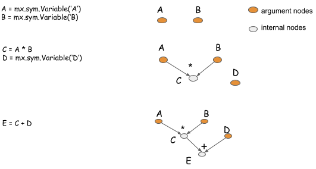
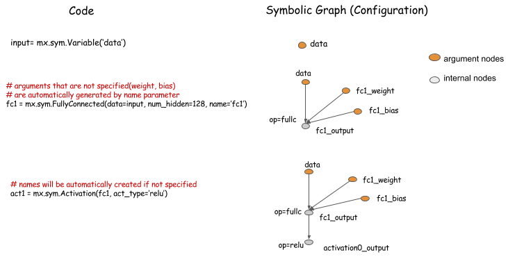
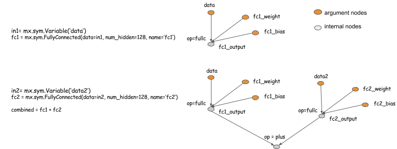
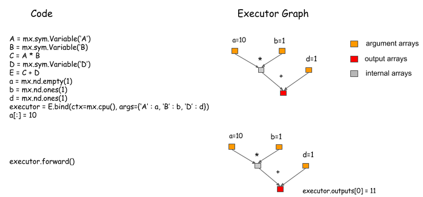
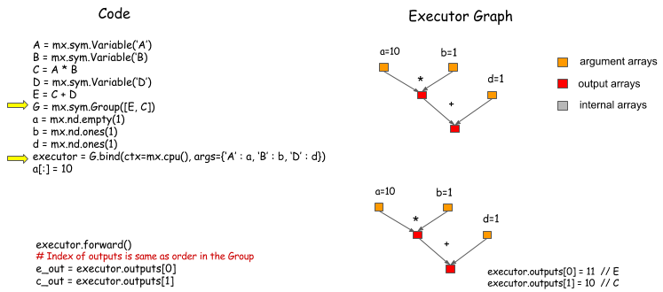
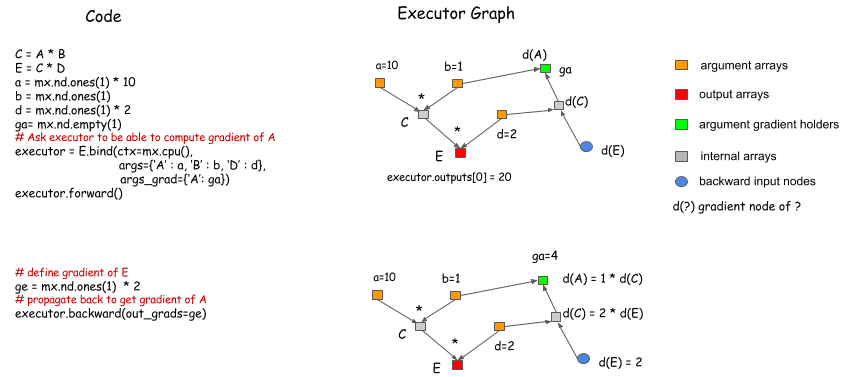
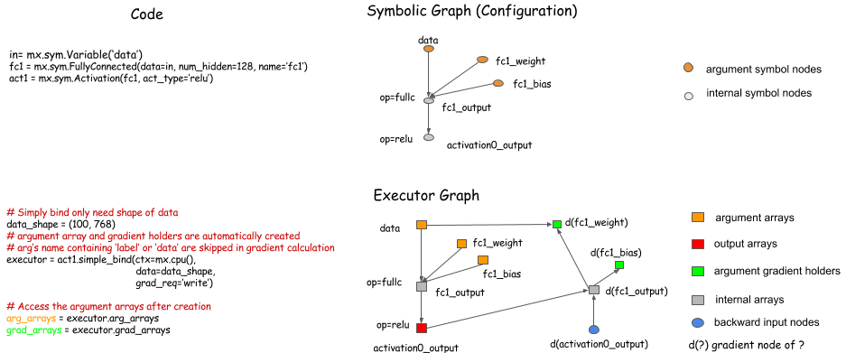

本节使用图片展示了如何符号式构建和执行计算图。我们强烈建议你同时阅读以下Symbolic API中的内容。

### 编写符号

符号是我们想要执行的计算的描述。符号式构建API可以生成描述计算过程的计算图。下图展示了如何使用符号来描述基本的计算过程。

- ` mxnet.symbol.Variable`函数创建了计算所需要的输入结点。
- 这类符号超越了基于元素的基本数学运算。

### 配置神经网络

除了支持细粒度的操作，MXNet还提供了一些方法用于执行类似于神经网络中layer的大型操作。你可以使用运算符来描述神经网络的配置过程

### 多输入的神经网络

下面的例子展示了如何配置多输入的神经网络

### 联结和执行符号

当你想要执行符号图的时候，你可以调用`bind`函数将`NDArray`和参数结点联结在一起，以获得`Executor`。

在将联结后的NDArray作为输入后，通过调用`Executor.Forward`来获得输出结果。

### 联结多个输出

使用`mx.symbol.Group`将符号分组，然后通过调用`bind`进行联结后获得两者输出。

注意：只需要联结你所需要的符号，这样系统可以获得更好的优化。

### 计算梯度

### 神经网路的bind接口

向bind函数传递NDArray参数是一件非常无聊的事情，尤其当你想要联结一个大的计算图时尤其如此。而`Symbol.simple_bind`函数则提供了一种相对简单的方式来执行这个过程。你只需要指定输入数据的形状即可。函数会为参数自动分配内存，并联结一个Executor。

### 辅助状态

辅助状态就像参数一样，但是你不会计算他们的梯度。尽管辅助状态并不是计算的一部分，但是他们有助于追踪计算的过程。你可以像传递参数一样传递辅助状态。

### 下一步
See Symbolic API and Python Documentation.
