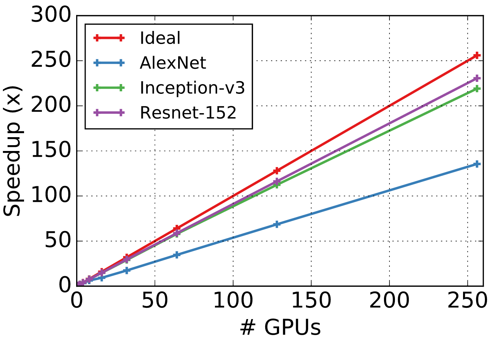

# 大规模图像分类

在大规模图像数据集上进行神经网络的训练存着着诸多挑战。即便使用最新的GPU，想要在合理的时间内使用单块GPU在大规模图像数据集上训练神经网络也几乎是不可能的。而在单台机器上使用多块GPU可以稍微降低这个问题的难度。但是一台机器可以连接的GPU数量是有限制的（通常为8或者16）。本教程将展示如何使用包含了多块GPU的多台机器在TB级别的数据上进行大型网络的训练。

### 准备工作

- MXNet
- OpenCV Python library


```python
$ pip install opencv-python
```

### 预处理

#### 磁盘空间

在大型数据集上进行训练的第一步就是下载和预处理数据。对于本教程，我们将使用完整的ImageNet数据集进行训练。请注意，要下载和预处理这些数据你至少需要有2TB的磁盘空间。在这里，我们强烈建议你使用SSD而不是HDD。因为SSD在处理大量的小体积图片时性能会更好。完成对图片的预处理和打包工作后（打包成recordIO格式），HDD也能够很好的完成训练的工作。

在本教程中，我们将使用AWS存储进行数据预处理。`i3.4xlarge`使用了两块`NVMe SSD`格式的硬盘，总容量为3.8TB。我们将使用RAID软件将它们组成一块硬盘，并将其挂载到`~/data`。


```python
sudo mdadm --create --verbose /dev/md0 --level=stripe --raid-devices=2 \
    /dev/nvme0n1 /dev/nvme1n1
sudo mkfs /dev/md0
sudo mkdir ~/data
sudo mount /dev/md0 ~/data
sudo chown ${whoami} ~/data
```

现在我们有了足够的磁盘空间来下载和预处理数据。

#### 下载ImageNet数据集

在本教程中，我们将使用完整的ImageNet数据集，数据集的下载地址为：http://www.image-net.org/download-images 。`fall11_whole.tar`文件中包含了所有的图片。整个数据集约1.2TB，因此你可能需要很长时间才能完成下载工作。

完成下载后，解压文件。


```python
export ROOT=full
mkdir $ROOT
tar -xvf fall11_whole.tar -C $ROOT
```

之后你会得到一个tar文件的集合。其中每一个tar文件代表着一个类别，文件当中包含着属于该类别的全部图像。我们将tar文件解压，并将所有的图像复制到以tar文件名命名的文件夹中。


```python
for i in $ROOT/*.tar; do j=${i%.*}; echo $j;  mkdir -p $j; tar -xf $i -C $j; done
rm $ROOT/*.tar

ls $ROOT | head
n00004475
n00005787
n00006024
n00006484
n00007846
n00015388
n00017222
n00021265
n00021939
n00120010
```

#### 移除不常见的类别（可选）

在ImageNet上进行网络训练的一个常见原因是为了迁移学习（包括特征提取和微调其他模型）。而对这项研究而言，图像太少的类别无助于迁移学习。所以，如果某个类别的图像数目少于一个特定的值，我们就将其移除。下面的代码将会移除图片数目少于500张的类别。


```python
BAK=${ROOT}_filtered
mkdir -p ${BAK}
for c in ${ROOT}/n*; do
    count=`ls $c/*.JPEG | wc -l`
    if [ "$count" -gt "500" ]; then
        echo "keep $c, count = $count"
    else
        echo "remove $c, $count"
        mv $c ${BAK}/
    fi
done
```

#### 生成验证集

为了确保我们的模型不会过拟合，我们从训练集中分离出一部分作为验证集。在训练过程中，我们会频繁地监视模型在验证集上的损失。


```python
VAL_ROOT=${ROOT}_val
mkdir -p ${VAL_ROOT}
for i in ${ROOT}/n*; do
    c=`basename $i`
    echo $c
    mkdir -p ${VAL_ROOT}/$c
    for j in `ls $i/*.JPEG | shuf | head -n 50`; do
        mv $j ${VAL_ROOT}/$c/
    done
done
```

#### 将图片打包成record文件

尽管MXNet可以直接读取图片，但是我们还是建议你将其打包成recordIo文件以提高训练的效率。使用MXNet提供的脚本工具(tools/im2rec.py)可以完成这项工作。在使用此脚本之前，你需要在系统中安装MXNet和opencv的python模型。

将环境变量`MXNet`指向MXNet的安装文件夹，并设置`NAME`为数据集的所在位置。这里，我们假设MXNet安装在了`～/mxnet`中。


```python
MXNET=~/mxnet
NAME=full_imagenet_500_filtered
```

在创建recordIO文件之前，我们首先需要创建一个包含了所有图片标签及路径的list文件，然后使用`im2rec`将list文件中的图片打包成recordIO文件。我们将在`train_meta`文件夹中创建这个list。原始的训练数据大约1TB，在这里我们将其分成了8部分，这样每个部分的大小大约在100GB左右。


```python
mkdir -p train_meta
python ${MXNET}/tools/im2rec.py --list True --chunks 8 --recursive True \
train_meta/${NAME} ${ROOT}
```

之后，我们将图片的短边缩放到480像素，然后将其打包进recordIO文件。由于这项工作大部分时间都花费在磁盘的输入/输出上，因此我们将使用多线程来更快地完成这个工作。


```python
python ${MXNET}/tools/im2rec.py --resize 480 --quality 90 \
--num-thread 16 train_meta/${NAME} ${ROOT}
```

完成之后，我们将`rec`文件移动到`train`文件夹中。


```python
mkdir -p train
mv train_meta/*.rec train/
```

对于验证集，重复上述工作。


```python
mkdir -p val_meta
python ${MXNET}/tools/im2rec.py --list True --recursive True \
val_meta/${NAME} ${VAL_ROOT}
python ${MXNET}/tools/im2rec.py --resize 480 --quality 90 \
--num-thread 16 val_meta/${NAME} ${VAL_ROOT}
mkdir -p val
mv val_meta/*.rec val/
```

现在，在`train`和`val`文件夹中，我们以recordIO格式分别储存了所有的训练和验证图片。我们终于可以开始使用这些`.rec`文件进行模型的训练了。

### 训练

在ImageNet竞赛中，[Resnet](https://arxiv.org/abs/1512.03385)已经展示了其有效性。我们的试验也重现了[这篇文章](https://github.com/tornadomeet/ResNet)中的结果。随着神经网络层数从18增加到152，我们可以看到验证准确率的逐步提升。鉴于这个数据集的规模庞大，我们将使用152层的Resnet。

由于计算复杂度之巨大，即便使用最快的GPU，完成一次数据集遍历所需要的时间也远远不止一天。然而在训练收敛到较好的验证准确率之前，我们通常需要遍历数据集数十个轮次。尽管我们可以在一台机器中使用多块GPU进行训练，然而一台机器的GPU数量通常被限制为8或者16。在本教程中，为了加速训练，我们将使用多GPU的多台机器进行模型的训练。

#### 设置

我们将使用16台机器（P2.16x），每台机器中包含了16块GPU（Tesla K80）。这些机器使用20 Gbps的以太网进行通讯。

使用AWS CloudFormation可以很方便地创建深度学习集群。我们遵循[此页面](https://aws.amazon.com/blogs/compute/distributed-deep-learning-made-easy/)的设置教程创建一个包含16个P2.16x的深度学习集群。

我们在第一台机器上加载数据和代码（同时，这台机器将成为master）。这台机器和其他机器之间通过EFS共享数据和代码。

如果你是在手动地设置集群，而不是使用了AWS提供的CloudFormation，那么请记得进行一下的设置。

- 使用`USE_DIST_KVSTORE=1 `编译MXNet以激活分布式训练。

- 在master机器上创建hosts文件，其中应该包含集群中所有机器的主机名，示例如下所示：


```python
$ head -3 hosts
deeplearning-worker1
deeplearning-worker2
deeplearning-worker3
```

完成设置后，应该能够在master机器上通过`ssh 主机名`的形式进入任意一台机器。示例如下：


```python
$ ssh deeplearning-worker2
===================================
Deep Learning AMI for Ubuntu
===================================
...
ubuntu@ip-10-0-1-199:~$
```

一种实现上述功能的方式为使用ssh代理转发。你可以在[这里](https://aws.amazon.com/blogs/security/securely-connect-to-linux-instances-running-in-a-private-amazon-vpc/)学习到如何进行设置。简短来说，你需要对机器进行配置以便使用本地的证书进行登录。然后，你使用证书和`-A`登录到master机器上。现在你就可以通过`ssh hostname`登录到集群中的任意一台机器上。（示例：`ssh deeplearning-worker2`）

#### 运行训练

在集群设置完成后，登录到master上并在${MXNET}/example/image-classification中运行一下指令。


```python
../../tools/launch.py -n 16 -H $DEEPLEARNING_WORKERS_PATH python train_imagenet.py --network resnet \
--num-layers 152 --data-train ~/data/train --data-val ~/data/val/ --gpus 0,1,2,3,4,5,6,7,8,9,10,11,12,13,14,15 \
--batch-size 8192 --model ~/data/model/resnet152 --num-epochs 1 --kv-store dist_sync
```

launch.py在集群的所有机器上启动提供给它的指令。集群中的机器李彪需要通过`-H`提供给launch.py。下面的列表列出了脚本需要用到的全部指令。

选项 | 描述
- | :-: | :-: 
n	| 指定每台机器上运行的工作程序作业数。因为我们在集群中有16台机器，因此指定作业数为16。
H	| 指定储存了集群中所有机器的主机名的文件路径。因为我们使用了AWS的深度学习云模板来创建集群，因此环境变量$DEEPLEARNING_WORKERS_PATH指向了所需要的文件。

train_imagenet.py的参数中，--network指定了所需要训练的网络类型，--data-train和--data-val指定了训练所需的数据。下表详细描述了train_imagenet.py的参数意义。

Option | Description
- | :-: | :-: 
network | 网络类型，可以是${MXNET}/example/image-classification中的任何一种网络。在教程中，我们使用了Resnet。
num-layers | 网络层数，这里我们使用了152层的Resnet
data-train | 储存训练图片的文件夹。这里我们指向了储存训练图片的EFS位置(~/data/train/)。
data-val | 储存验证图片的文件夹。这里我们指向了储存验证图片的EFS位置(~/data/val)。
batch-size | 所有GPU上的总批次大小，等于批次每GPU×GPU总数目。我们在每个GPU上使用的批次大小为32，因此最有效的总批次大小为32×16*16=8192。
model | 储存训练模型的路径。
num-epochs | 训练的轮次数
kv-store | 参数同步的键值存储。由于我们使用的是分布式的训练，因此在这里也是用分布式的键值存储。

在训练结束后，你可以在--model指定的文件夹中找到训练好的模型。模型文件分为两部分：在`model-symbol.json`中存储着模型的定义，而在`model-n.params`中存储着n轮训练之后的模型参数。

#### 可扩展性

在使用大量机器进行训练时，一种普遍的担忧是模型的扩展性如何。我们在含有多达256块GPU的集群上训练了若干个流行的网络模型，最终的加速比非常接近理想情况。

扩展性实验在16个P2.16xl实例上进行，其中共包含了256块GPU。在AWS的深度学习AMI上安装的CUDA为7.5版本，CUDNN为5.1版本。

我们将每块GPU上所使用的批次大小固定，并在后续测试中不断加倍GPU的数目。训练中使用了同步式SGD（–kv-store dist_device_sync）。所使用的卷积神经网络可以在[这里](https://github.com/dmlc/mxnet/tree/master/example/image-classification/symbols)找到。

 | alexnet | inception-v3 | resnet-152
- | :-: | :-: 
batch size per GPU | 512 | 32 | 32
model size (MB) | 203 | 95 | 240

每秒钟所能处理的图片数目如下表所示：

Number of GPUs | Alexnet | Inception-v3 | Resnet-152
- | :-: | :-: 
1 | 457.07 | 30.4 | 20.8
2 | 870.43 | 59.61 | 38.76
4 | 1514.8 | 117.9 | 77.01
8 | 2852.5	 | 233.39 | 153.07
16 | 4244.18 | 447.61 | 298.03
32 | 7945.57 | 882.57 | 595.53
64 | 15840.52 | 1761.24 | 1179.86
128 | 31334.88 | 3416.2 | 2333.47
256 | 61938.36 | 6660.98 | 4630.42


下图显示了对不同的模型进行训练时，使用不同数量GPU时的加速比情况，图中也包含了理想的加速比。



### 故障排除指南

**验证集准确率**

实现合理的验证准确率通常非常简单，但是要达到最新的论文中的结果有时却会非常困难。为了实现这个目标，你可以尝试下面列出的几点建议。

- 使用数据增广常常可以减少训练准确率和验证准确率之间的差别。当接近训练末期的时候，数据增广应该减少一些。
- 训练开始的时候使用较大的学习率，并保持较长一段时间。例如说，在CIFAR10上进行训练时，你可以在前200轮都使用0.1的学习率，然后将其减少为0.01。
- 不要使用太大的批次，尤其是批次大小远远超过了类别的数目。

#### 速度

- 分布式训练在大大提高训练速度的同时，每个批次的计算成本也都很高。因此，请确保你的工作量不是很小（诸如在MNIST数据集上训练LeNet），请确保批次的大小在合理的范围内较大。
- 请确保数据读取和预处理不是瓶颈。将--test-io选项设置为1来检查每秒钟工作集群可以处理多少张图片。
- 通过设置--data-nthreads来增加数据处理的线程数（默认为4）.
- 数据预处理是通过opencv实现的。如果你所使用的opencv编译自源码，请确保它能够正确工作。
- 通过设置--benchmark为1来随机的生成数据，和使用真实的有序数据相比，能够缩小一部分瓶颈。
- 在[本页](https://mxnet.incubator.apache.org/faq/perf.html)中你可以获取到更多相关信息。

#### 显存

如果批次过大，就会超出GPU的容量。当发生这种情况是，你可以看到类似于“cudaMalloc failed: out of memory”的报错信息。有几种方式可以解决这一问题。

- 减小批次的大小。
- 将环境变量MXNET_BACKWARD_DO_MIRROR设置为1，它可以通过牺牲速度来减少显存的消耗。例如，在训练批次大小为64时，inception-v3会用掉10G的显存，在K80 GPU上每秒钟大约可以训练30张图片。当启用镜像后，使用10G的显存训练inception-v3时我们可以使用128的批次大小，但代价时每秒钟能够处理的图片数下降为约27张每秒。
